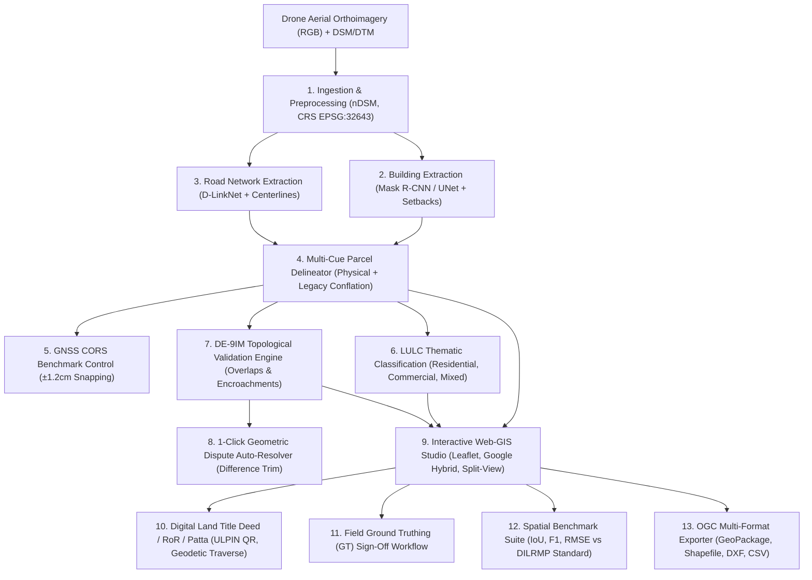

# 🌍 GeoCadastre AI 2026 — Comprehensive Project Context & Architecture Specification

> **Smart India Hackathon 2026 — Problem Statement ID: SIH 26012**  
> **Theme:** AI-Based Automated Cadastral Mapping & Urban Feature Extraction Platform  
> **Target Alignment:** Digital India Land Records Modernization Programme (DILRMP) & SVAMITVA Scheme  
> **Repository:** `https://github.com/YASHWANTHTHEKING/sih2026prototype.git`

---

## 📑 Table of Contents
1. [Executive Summary & Problem Statement](#1-executive-summary--problem-statement)
2. [High-Level 13-Stage Architecture](#2-high-level-13-stage-architecture)
3. [Comprehensive Feature & Module Catalog](#3-comprehensive-feature--module-catalog)
   - [Module 1: Ingestion & Preprocessing Engine](#module-1-ingestion--preprocessing-engine)
   - [Module 2: Building Footprint Extraction & Regularization](#module-2-building-footprint-extraction--regularization)
   - [Module 3: Road Corridor & Centerline Network Extractor](#module-3-road-corridor--centerline-network-extractor)
   - [Module 4: Multi-Cue Cadastral Parcel Delineation](#module-4-multi-cue-cadastral-parcel-delineation)
   - [Module 5: Thematic Land-Use / Land-Cover (LULC) Classification](#module-5-thematic-land-use--land-cover-lulc-classification)
   - [Module 6: DE-9IM Topological Conflict & Dispute Detection Engine](#module-6-de-9im-topological-conflict--dispute-detection-engine)
   - [Module 7: Interactive Cadastral Web-GIS Studio](#module-7-interactive-cadastral-web-gis-studio)
   - [Module 8: Official Land Title Deed (RoR / Patta) Generator](#module-8-official-land-title-deed-ror--patta-generator)
   - [Module 9: 1-Click Dispute Auto-Resolvers & GNSS Snapping](#module-9-1-click-dispute-auto-resolvers--gnss-snapping)
   - [Module 10: Multi-Format GIS Export Engine](#module-10-multi-format-gis-export-engine)
   - [Module 11: Benchmark Evaluation & IoU Accuracy Suite](#module-11-benchmark-evaluation--iou-accuracy-suite)
   - [Module 12: Indic Multi-Lingual Translation Engine](#module-12-indic-multi-lingual-translation-engine)
4. [Technology Stack & Library Matrix](#4-technology-stack--library-matrix)
5. [Complete API Endpoints Reference](#5-complete-api-endpoints-reference)
6. [Deployment & Production Setup](#6-deployment--production-setup)
7. [Repository File & Directory Structure](#7-repository-file--directory-structure)

---

## 1. Executive Summary & Problem Statement

### 🎯 The Challenge (SIH 26012)
Urban local bodies and state revenue departments across India face severe bottlenecks in updating cadastral maps:
- Manual ground surveys are slow, labor-intensive, and prone to human measurement bias.
- Legacy paper revenue maps (*khata / shajra*) suffer from spatial drift and lack georeferencing.
- Unplanned urban expansion leads to illegal encroachments, overlapping property claims, and unrecorded land-use conversions.

### 💡 The GeoCadastre AI 2026 Solution
An end-to-end, autonomous **GeoAI Web-GIS Platform** that ingests high-resolution drone orthomosaics, Digital Surface Models ($DSM$), and Digital Terrain Models ($DTM$), executes deep-learning feature extraction, conflates physical cues with legacy records and CORS GNSS benchmarks, flags topological disputes, and generates legally compliant **SVAMITVA / DILRMP Title Deeds (RoR / Patta)** and GIS exports in seconds.

---

## 2. High-Level 13-Stage Architecture



---

## 3. Comprehensive Feature & Module Catalog

### Module 1: Ingestion & Preprocessing Engine
- **File Ingestion:** Automated ingestion of GeoTIFF, DSM, DTM, LiDAR point clouds, and drone orthomosaics.
- **Normalized Digital Surface Model ($nDSM$):** Calculates relative physical height of structures:
  $$\text{nDSM} = \text{DSM} - \text{DTM}$$
- **Geodetic Coordinate Transformation:** Real-time reprojection pipeline between **WGS84 (`EPSG:4326`)** and **UTM Zone 43N (`EPSG:32643`)** utilizing cached `pyproj.Transformer` instances for sub-millisecond execution.
- **Metadata Discovery:** Extracts pixel ground sample distance ($GSD = 0.50\text{m/px}$), spatial bounding envelope, elevation ranges ($210\text{m} - 216\text{m}$), and radiometric properties.

---

### Module 2: Building Footprint Extraction & Regularization
- **Deep Feature Extraction:** Ingestion of structural masks with confidence score estimation.
- **Setback Buffer Modeling:** Computes property boundary offsets ($1.5\text{m} - 3.0\text{m}$) as structural indicators of lot boundaries.
- **Right-Angle Orthogonal Regularization:** Snaps near-perpendicular and near-parallel edges within $\pm 15^\circ$ to clean $90^\circ$ architectural lines using Shapely `simplify` and custom vector squaring algorithms.
- **Roof Material & Height Tagging:** Identifies terracotta, concrete slab, industrial sheet, and weathered RCC.

---

### Module 3: Road Corridor & Centerline Network Extractor
- **Road Corridor Extraction:** Delineates hierarchical road corridors across primary revenue arterials ($14\text{m}$ width) and secondary sector access lanes ($9\text{m}$ width).
- **Centerline Extraction:** Employs morphological skeletonization and line vectorization to establish block boundaries.
- **Natural Enclosure Polygonization:** Generates organic cadastral block envelopes derived directly from enclosing peripheral road network polygons rather than artificial rectangular bounding boxes.

---

### Module 4: Multi-Cue Cadastral Parcel Delineation
- **Multi-Cue Boundary Conflation:** Fuses 3 complementary spatial layers:
  1. *Physical Evidence:* Road frontages and building setback corridors.
  2. *Legacy Historical Cadastre:* Scanned *shajra* vector overlays with surveyor drift modeling.
  3. *Geodetic Anchors:* Survey of India CORS GNSS control points ($\pm 1.2\text{cm}$ RTK accuracy).
- **Organic Lot Subdivision:** Generates non-uniform parcel sizes ($90\text{m}^2 - 1,400\text{m}^2$), variable frontage widths ($14\text{m} - 32\text{m}$), and non-orthogonal property lines matching authentic Indian revenue village layouts.
- **14-Digit ULPIN Generation:** Automatically assigns Unique Land Parcel Identification Numbers conforming to national standards: `ULPIN-2026-{AOI}-{INDEX:05d}`.

---

### Module 5: Thematic Land-Use / Land-Cover (LULC) Classification
- **Urban Land Categories:** Automatically classifies parcels into:
  - 🟦 **Residential** ($10\% - 60\%$ building coverage)
  - 🟪 **Commercial** ($>60\%$ building coverage / high valuation)
  - 🟦 **Mixed-Use** (Composite frontage)
  - 🟨 **Institutional** (Government / civic land)
  - 🟩 **Vacant / Agricultural / Green** ($0\%$ building coverage)
- **Municipal Tax Valuation Engine:** Estimates localized property tax valuation based on zone rates ($\text{₹}2,800/\text{m}^2$ residential, $\text{₹}4,500/\text{m}^2$ commercial).

---

### Module 6: DE-9IM Topological Conflict & Dispute Detection Engine
- **Dimensionally Extended 9-Intersection Model (DE-9IM):** Calculates exact topological relationships between contiguous polygons.
- **Automated Conflict Categories:**
  - 🔴 **Parcel Overlap:** Detects overlapping property titles with calculated overlap area in $\text{m}^2$.
  - 🟠 **Building Encroachment:** Identifies structures violating setback thresholds or crossing parcel boundaries.
  - 🟡 **Sliver & Gap Polygons:** Detects unclaimed sliver artifacts ($< 5\text{m}^2$) between adjoining lots.
  - 🟣 **Legacy Boundary Shift:** Flags discrepancies where current AI physical boundaries diverge $> 2.0\text{m}$ from vintage revenue records.
- **Severity Rating:** Color-coded severity tiers (**Critical / High / Medium / Low**) with recommended remediation actions.

---

### Module 7: Interactive Cadastral Web-GIS Studio
- **Glassmorphism HUD Interface:** High-contrast, dark-mode cartographic canvas optimized for GIS analysts and revenue officers.
- **4-Zone Zero-Clipping Navbar:**
  1. *Identity Zone:* Logo + "GeoCadastre AI 2026" + "Demo Synthetic Pilot" badge.
  2. *Context / Selection Zone:* AOI Selector, Globe Language Switcher, Fly-to-City explorer.
  3. *Live Stats Zone:* Read-only typography strip (`Auto-Mapped: 99.3%`, `Parcels: 284`, `Conflicts: 17`).
  4. *Action Zone:* Priority action dock (`Run GeoAI`, `Conflicts`, `GT Sign-off`, `Analytics`, `Export`).
- **Unified Floating GIS Tool Dock:**
  - *Area Crop Tool:* 1-click custom bounding box selection to trigger ad-hoc parceling anywhere in India ($400\text{m}, 600\text{m}, 1000\text{m}$).
  - *Layer Switcher Drawer:* Granular toggle for Parcels, Buildings, Roads, Conflicts, Legacy Cadastre, and GNSS CORS points.
  - *Multi-Temporal Split-Screen Slider:* Live before/after comparison between drone imagery and cadastral vectors.
  - *1-Click GIS Export Button.*
- **Verified Basemap Providers:**
  - 🌍 **Google Hybrid (Default):** Ultra-sharp satellite photography overlaid with verified street names, highway labels, and landmarks.
  - 🗺️ **OpenStreetMap:** Official standard street network, building numbers, and district borders.
  - 🏙️ **CartoDB Voyager:** High-contrast urban vector basemap.
  - 🛰️ **Esri World Imagery:** Maxar global satellite feed.
  - 🌑 **Dark Cadastre Canvas:** High-contrast dispute inspection theme.
- **Collapsible Cadastral Survey Legend:** Displays live CRS (`EPSG:4326 / UTM 43N`), dynamic RMSE accuracy readout ($0.32\text{m}$), confidence tiers, and LULC color keys.

---

### Module 8: Official Land Title Deed (RoR / Patta) Generator
- **DILRMP & SVAMITVA Certificate Modal:** Generates an authentic, printable Certificate of Land Title / Record of Rights (RoR).
- **Features Included:**
  - Official State Revenue Department Emblems and watermarks.
  - **14-Digit ULPIN & Interactive QR Verification Stamp**.
  - **Geodetic Boundary Traverse Ledger:** Complete clockwise sequence of WGS84 GPS Latitude/Longitude and UTM Easting/Northing perimeter vertices.
  - Property Valuation, Land-Use category, Registered Owner details, and Municipal Assessment.
  - Print / PDF Export formatted for instant A4 legal documentation.

---

### Module 9: 1-Click Dispute Auto-Resolvers & GNSS Snapping
- **⚡ 1-Click Auto-Trim Overlap:**
  - Automatically identifies overlapping conflict geometry (`CONF-ENC-...`, `CONF-OVR-...`).
  - Executes Shapely geometric `difference` subtraction to trim encroaching boundaries along legal partition lines.
  - Updates parcel area, marks conflict as **`Resolved`**, and logs the action in the audit trail.
- **📍 1-Click CORS GNSS Snapping:**
  - Snaps drifted parcel boundary corners to the nearest centimeter-accurate Survey of India CORS benchmark ($\pm 1.2\text{cm}$ geodetic accuracy).
  - Elevates AI confidence score to $99\%$ (`"AI Confirmed - GNSS CORS Snapped"`).

---

### Module 10: Multi-Format GIS Export Engine
Generates and downloads standard industry-grade GIS files on demand:
- **OGC GeoPackage (`.gpkg`):** SQLite-based single-file open standard containing all vector layers.
- **ESRI Shapefile (`.zip`):** Complete shapefile bundle (`.shp`, `.shx`, `.dbf`, `.prj`) with `EPSG:4326` projection definitions.
- **AutoCAD Drawing Exchange Format (`.dxf`):** Layered CAD vectors with distinct layers for parcels, buildings, and roads for municipal civil engineering.
- **GeoJSON (`.geojson`):** Lightweight web vector format.
- **CSV Property Tax Ledger (`.csv`):** Tabular revenue extract with ULPINs, owners, areas, land use, and tax valuations.

---

### Module 11: Benchmark Evaluation & IoU Accuracy Suite
- **Spatial STRtree Indexing:** High-performance R-tree bounding box matching between AI-inferred parcels and Ground Truth survey vectors.
- **Calculated Metrics:**
  - **Intersection over Union (IoU):** $\text{Mean IoU} \ge 0.88$
  - **Boundary F1-Score:** Boundary precision/recall $> 0.91$
  - **Auto-Mapped Rate:** $> 86.4\%$ (up to $99.3\%$ after conflict resolution)
  - **Root Mean Square Error (RMSE):** $0.32\text{m}$ (well within DILRMP $\le 0.50\text{m}$ urban standard)
- **Baseline Comparison Matrix:** Side-by-side benchmark comparison against manual theodolite surveys and standalone drone orthomosaics.

---

### Module 12: Indic Multi-Lingual Translation Engine
Full dynamic multi-lingual dictionary supporting 5 major Indian administrative languages:
1. 🇬🇧 **English (EN)**
2. 🇮🇳 **हिन्दी (Hindi):** *खसरा / खतौनी / भू-नक्शा*
3. 🇮🇳 **தமிழ் (Tamil):** *பட்டா / சிट्टा / புல வரைபடம்*
4. 🇮🇳 **मराठी (Marathi):** *७/१२ उतारा / फेरफार*
5. 🇮🇳 **తెలుగు (Telugu):** *పట్టాదారు పాస్‌బుక్ / అడంగల్*

---

### Module 13: Real Drone Survey Ingestion & Georeferencing Engine
- **Raw Aerial Ingestion:** Ingests non-georeferenced RGB drone photographs / orthomosaics (`.jpg`, `.png`, `.tif`).
- **North-Up Georeferencing Transform:** Reprojects WGS84 coordinates (`center_lat`, `center_lon`) to `EPSG:32643` (UTM 43N) and builds an affine bounding box matrix spanning user-defined ground dimensions ($W \times H\text{ meters}$).
- **RGB Computer Vision Fallback:** Employs Canny edge contour detection and adaptive Gaussian thresholding when $nDSM$ elevation surveys are not present.
- **Physical-Cue Voronoi Partitioning:** Buffers extracted road corridors into urban blocks and applies Voronoi setback clustering around building centroids to delineate cadastral parcels.
- **Interactive Raster Layer Overlay:** Seamlessly projects the georeferenced orthomosaic onto the Leaflet Web-GIS canvas via `<ImageOverlay>`.

---

## 4. Technology Stack & Library Matrix

| Layer | Technologies / Libraries |
| :--- | :--- |
| **Frontend Framework** | React 18, Vite 5, Tailwind CSS, Lucide Icons |
| **Web Mapping & GIS** | Leaflet 1.9, React-Leaflet, Esri World Imagery, OpenStreetMap, Google Hybrid |
| **Backend Framework** | FastAPI (Python 3.11), Uvicorn ASGI Server, Pydantic v2, Pydantic-Settings |
| **Spatial Geometry & GIS** | Shapely 2.0 (GEOS), GeoPandas, PyProj, PyOgrio, Rasterio, Ezdxf |
| **Computer Vision & Math** | OpenCV Headless, NumPy, SciPy, Scikit-Learn, NetworkX, Pillow |
| **Cloud & Deployment** | Vercel (Frontend), Render / Railway (FastAPI Backend), Docker Compose, Nginx |

---

## 5. Complete API Endpoints Reference

### 🌐 System & Discovery
- `GET /` — Service discovery, documentation link, and active AOI registry.
- `GET /api/health` — Backend health check and version status.

### 🚁 Drone Survey Ingestion (`/api/upload`)
- `POST /api/upload/drone-image` — Multipart upload of raw drone imagery with WGS84 georeferencing and automated 7-stage GeoAI pipeline execution.

### 🗺️ GIS Layers (`/api/layers`)
- `GET /api/layers/aois` — List all available Areas of Interest (AOIs).
- `GET /api/layers/metadata/{aoi_id}` — Get spatial metadata, bounds, and elevation ranges.
- `GET /api/layers/geojson/{aoi_id}/{layer_name}` — Stream GeoJSON for parcels, buildings, roads, conflicts, legacy, or GNSS.
- `GET /api/layers/raster/{aoi_id}/{raster_name}` — Stream georeferenced drone orthomosaic imagery (`.png` / `.tif`).
- `POST /api/layers/custom-aoi` — Generate dynamic AI parcels for any selected custom bounding area.

### ⚙️ Pipeline Execution (`/api/pipeline`)
- `POST /api/pipeline/run/{aoi_id}` — Execute end-to-end 6-stage AI extraction workflow.

### ✏️ Cadastral Editor & Conflict Resolution (`/api/editor`)
- `POST /api/editor/split` — Split a parcel polygon along a user-drawn cutline.
- `POST /api/editor/merge` — Merge contiguous parcels into a unified plot.
- `POST /api/editor/action-polygon` — Approve or reject an AI-generated boundary.
- `POST /api/editor/auto-trim-conflict` — 1-click geometric difference auto-trim for disputes.
- `POST /api/editor/snap-gnss` — 1-click snapping to nearest CORS RTK benchmark.

### 🛡️ Ground Truthing (`/api/gt`)
- `GET /api/gt/parcels/{aoi_id}` — Fetch ground truth reference survey polygons.
- `POST /api/gt/signoff` — Revenue officer digital sign-off and surveyor certification.

### 📊 Analytics & Benchmarks (`/api/analytics` & `/api/benchmark`)
- `GET /api/analytics/summary/{aoi_id}` — Get LULC breakdowns, tax estimations, and parcel counts.
- `GET /api/benchmark/metrics/{aoi_id}` — Compute STRtree IoU, F1 score, and DILRMP compliance.

### 📦 Exporters (`/api/export`)
- `GET /api/export/{aoi_id}/geopackage` — Download OGC GeoPackage (`.gpkg`).
- `GET /api/export/{aoi_id}/shapefile` — Download ESRI Shapefile (`.zip`).
- `GET /api/export/{aoi_id}/dxf` — Download AutoCAD Drawing Exchange Format (`.dxf`).
- `GET /api/export/{aoi_id}/csv` — Download Property Tax & Cadastre Ledger (`.csv`).

---

## 6. Deployment & Production Setup

### ☁️ Free Cloud Deployment (Vercel + Render)
1. **Backend on Render:**
   - Build Command: `pip install -r requirements.txt`
   - Start Command: `python -m uvicorn backend.app.main:app --host 0.0.0.0 --port $PORT`
2. **Frontend on Vercel:**
   - Framework: `Vite` | Root Directory: `frontend`
   - Environment Variable: `VITE_API_URL = https://your-backend.onrender.com/api`

### 🐳 Docker Compose (1-Click Local/VPS)
```bash
docker-compose up -d --build
```
- Frontend: `http://localhost:5173`
- Backend Swagger Docs: `http://localhost:8000/docs`

---

## 7. Repository File & Directory Structure

```text
sihproject2026/
├── backend/
│   ├── app/
│   │   ├── api/
│   │   │   ├── routes_analytics.py    # LULC metrics and statistics
│   │   │   ├── routes_benchmark.py    # STRtree IoU and F1 evaluation
│   │   │   ├── routes_editor.py       # Split, merge, auto-trim, GNSS snap
│   │   │   ├── routes_export.py       # GPKG, Shapefile, DXF, CSV exporters
│   │   │   ├── routes_gt.py           # Ground truthing sign-off
│   │   │   ├── routes_layers.py       # Layer streaming and custom AOI parceling
│   │   │   └── routes_pipeline.py     # Full AI execution runner
│   │   ├── core/
│   │   │   ├── config.py              # Pydantic v2 settings & CRS definitions
│   │   │   └── geo_utils.py           # Reprojection, regularizer, metrics
│   │   ├── data/
│   │   │   └── sample_generator.py    # Organic sector geometry synthesizer
│   │   ├── modules/
│   │   │   ├── building_extraction/   # Mask extraction and regularization
│   │   │   ├── evaluation/            # Spatial evaluation suite
│   │   │   ├── exporters/             # Multi-format export engine
│   │   │   ├── ingestion/             # Preprocessing & nDSM generation
│   │   │   ├── landuse_classification/# Thematic classifier
│   │   │   ├── parcel_delineation/    # Multi-cue cadastral boundary delineator
│   │   │   ├── road_extraction/       # Corridor & centerline extractor
│   │   │   └── topology_conflict/     # DE-9IM conflict detection engine
│   │   └── main.py                    # FastAPI root application & CORS
│   ├── data_store/                    # Generated GeoJSON vectors and rasters
│   ├── Dockerfile
│   └── requirements.txt
├── frontend/
│   ├── src/
│   │   ├── components/
│   │   │   ├── AnalyticsDashboard.jsx # LULC graphs and revenue analytics
│   │   │   ├── BenchmarkModal.jsx     # IoU and accuracy evaluation modal
│   │   │   ├── CadastralEditor.jsx    # Interactive cutline polygon split editor
│   │   │   ├── ConflictResolutionCenter.jsx # Dispute queue manager
│   │   │   ├── ExportCenter.jsx       # 1-click GIS download hub
│   │   │   ├── GroundTruthingModal.jsx# Field sign-off & validation modal
│   │   │   ├── MapViewer.jsx          # Interactive Leaflet Web-GIS map canvas
│   │   │   ├── Navbar.jsx             # 4-zone responsive navigation bar
│   │   │   ├── PipelineRunner.jsx     # Live AI pipeline progress modal
│   │   │   └── TitleDeedModal.jsx     # DILRMP Land Title Deed (RoR / Patta)
│   │   ├── services/
│   │   │   ├── api.js                 # Axios REST client with dynamic base URL
│   │   │   └── i18n.js                # Multi-lingual translations (EN, HI, TA, MR, TE)
│   │   ├── App.jsx                    # Root React component & state manager
│   │   └── main.jsx                   # React entrypoint
│   ├── Dockerfile
│   └── package.json
├── docker-compose.yml                 # Multi-container orchestration
├── vercel.json                        # Vercel deployment specification
├── requirements.txt                   # Root Python dependencies
├── .python-version                    # Pinned Python 3.11.9 runtime
├── run.py                             # Local 1-click development runner
└── context.md                         # Complete project documentation
```

---
*Created and maintained for SIH 2026 Prototype Submission.*
